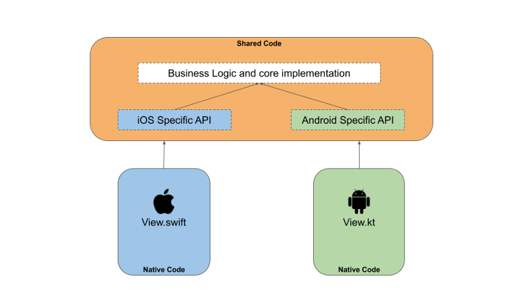

# KMMExample01
## Developed By Mahdi Razzaghi Ghaleh
#### **Thanks to codingwithmitch**
#### My First Kmm App

## What is KMM?
Allows you to write code once and use on multiple platforms such as Android and iOS.
It reduces testing effort.
Has a less maintenance headache, as modification comes easy and fast.
It’s using Kotlin and that is statically typed language and gives benefit of native programming language.
For Android engineers nothing really changes and for iOS project we just import a framework just like any Swift based framework.
If you plan appropriately development time can be reduced to 30–40% for iOS where they only have to write UI layer for it.

# Still working on it...

### some Ideas:
https://proandroiddev.com/kmm-quickstart-guide-7598527a2ab9
https://medium.com/globant/kotlin-multiplatform-mobile-kmm-code-sharing-between-android-and-ios-9a9af66e2655